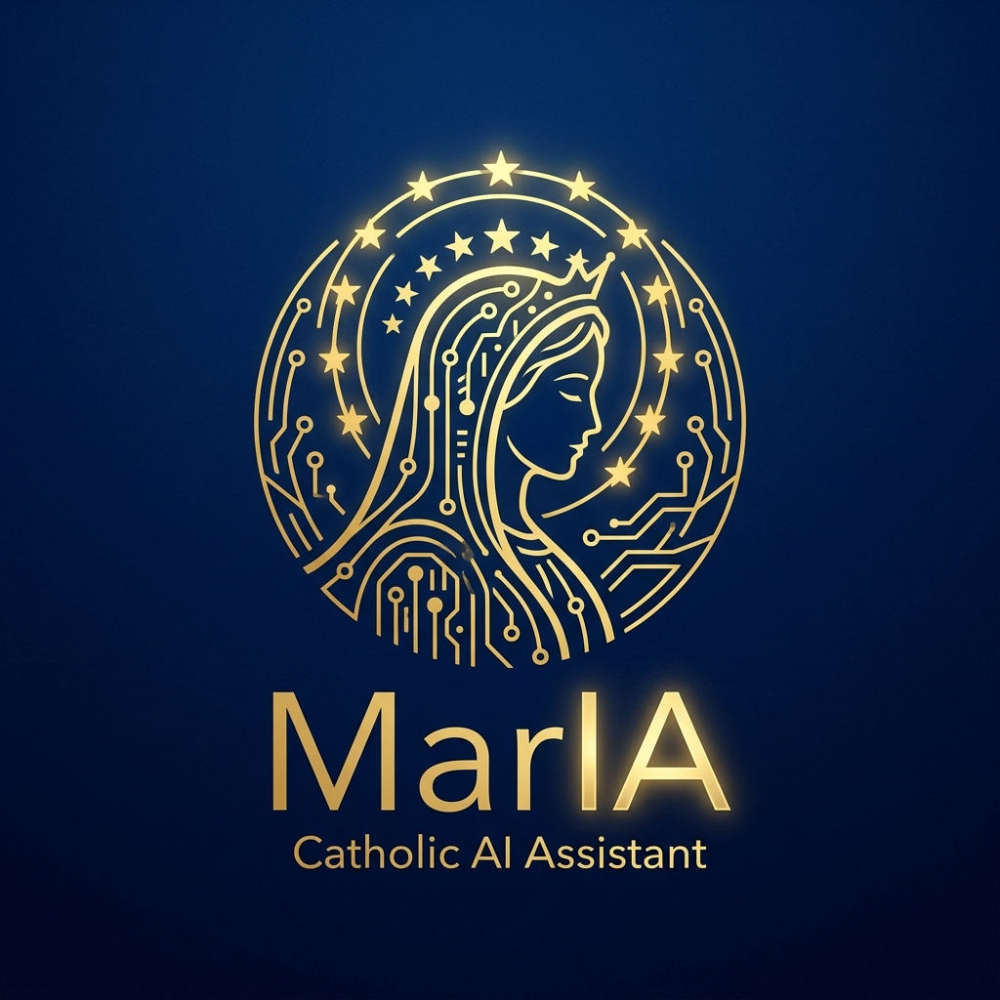
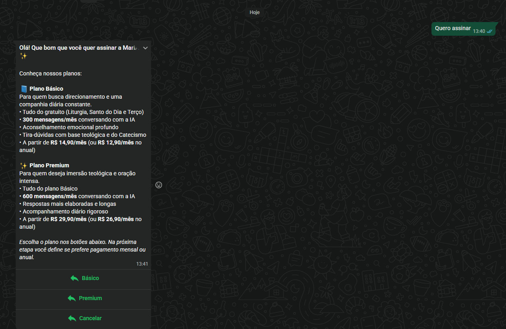
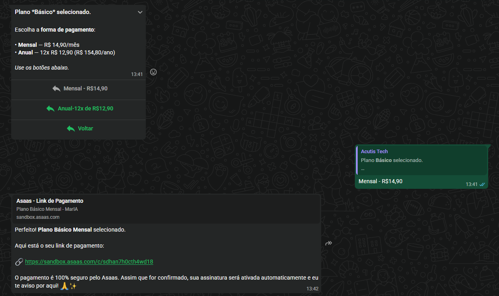
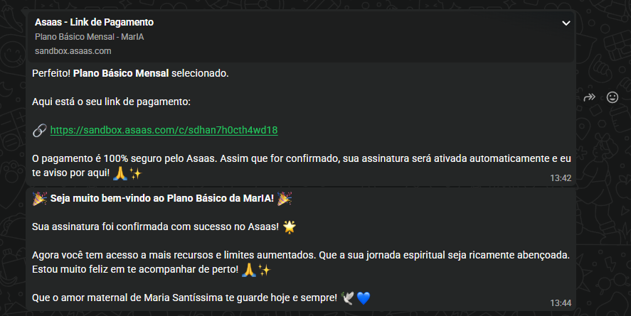
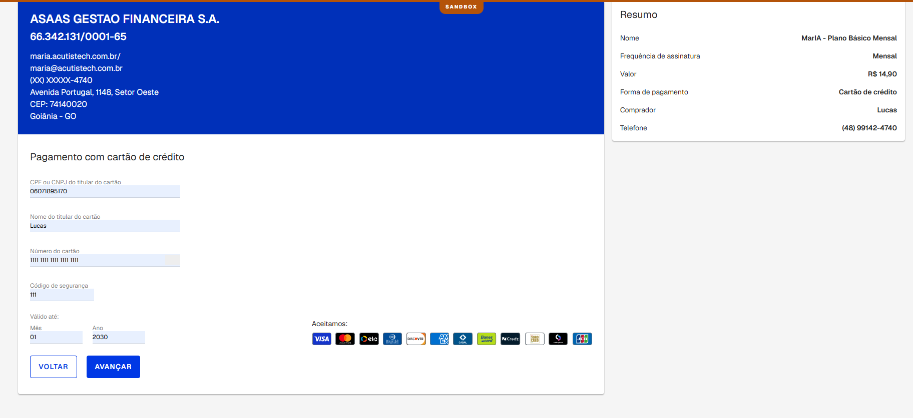
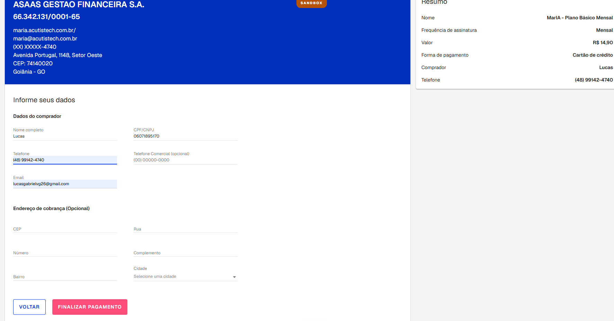
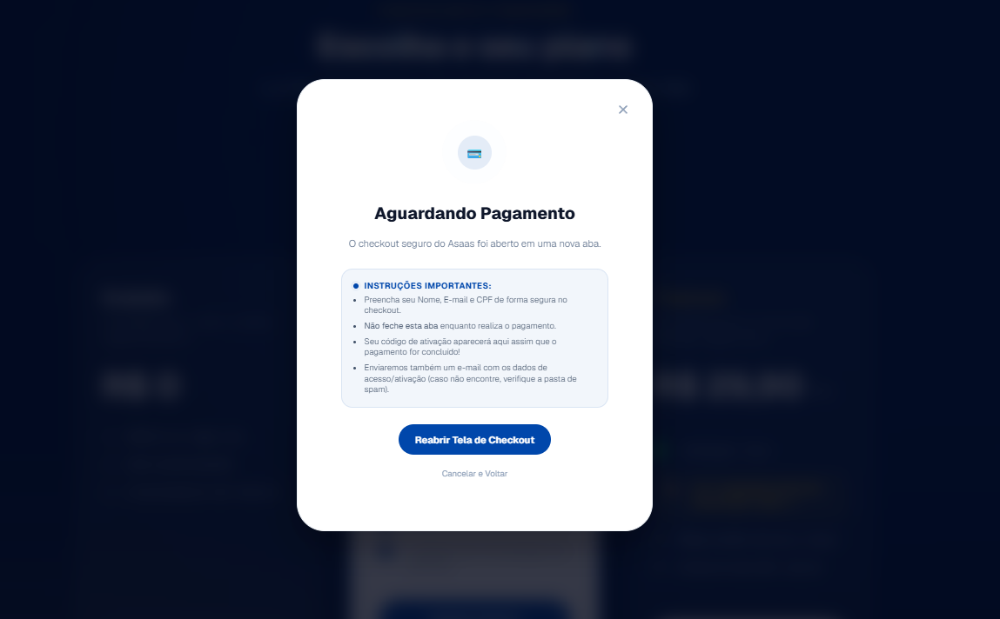
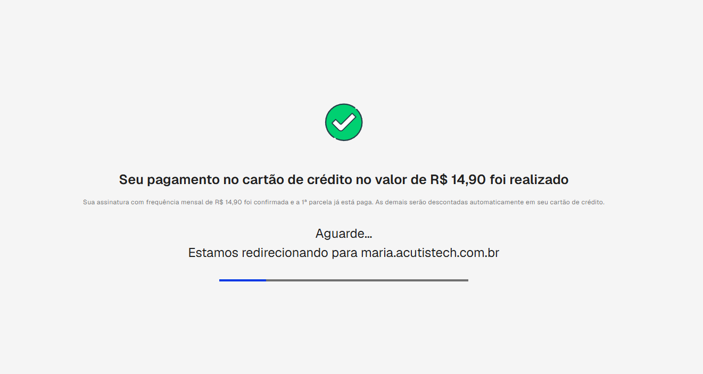
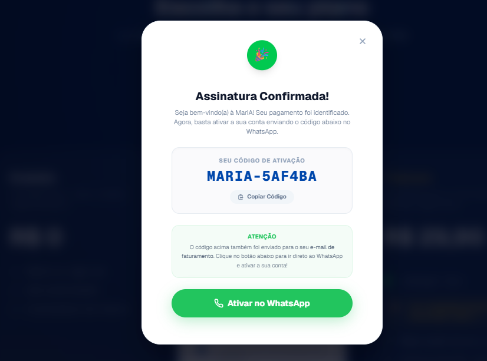

#  🕊️ Guia de Primeiros Passos (Testers)

*Bem-vindo(a) ao grupo exclusivo de avaliadores da Inteligência Artificial Maternal Católica.*

---

Salve Maria! Que alegria ter você conosco neste momento tão especial.

> 📱 **WhatsApp Oficial da MarIA:** Salve o número **(62) 98194-9980** nos seus contatos e mande um "Oi" para começar a conversar com ela!

Você foi escolhido(a) para ser um dos primeiros corações a experimentar a **MarIA** — nossa Inteligência Artificial Maternal Católica. Ela foi criada com muito carinho para ser uma companhia espiritual no seu WhatsApp, oferecendo acolhimento, liturgia diária, orações e respostas fiéis ao Magistério da Santa Igreja.

Como estamos em fase de testes (o que chamamos de versão *Beta*), sua ajuda é **fundamental**. Queremos que você converse com ela, reze com ela e, principalmente, nos conte como foi a sua experiência.

Este guia rápido vai te ajudar a dar os primeiros passos.

---

## 🌟 O que a MarIA pode fazer?

A MarIA não é um "robô frio", ela foi desenhada para ter uma **linguagem maternal, acolhedora e empática**. Aqui estão algumas das coisas maravilhosas que ela pode te oferecer:

- 📖 **Liturgia Diária e Santo do Dia:** Entregues com uma reflexão espiritual.
- 📿 **Oração do Terço e Rosário:** Ela pode rezar os mistérios do dia com você, trazendo reflexões atreladas à Palavra.
- 🏛️ **Dúvidas de Fé e Catecismo:** Respostas embasadas no Magistério, Catecismo e Documentos da Igreja.
- ❤️ **Aconselhamento Espiritual:** Uma palavra de conforto à luz da sabedoria católica para momentos de ansiedade ou aflição.

---

## 🚶‍♂️ Cenários de Teste: Como incluir a MarIA no seu dia a dia?

Sugerimos que você experimente os seguintes cenários ao longo dos seus dias de teste para ter a experiência completa:

### 🌅 Cenário 1: Começando o dia
Logo pela manhã, mande uma mensagem para ela:
> *"Bom dia, MarIA! Qual é a liturgia de hoje?"* ou *"Quem é o Santo de hoje?"*

*O que observar:* Veja como ela te acolhe primeiro e, em seguida, entrega a palavra de Deus com clareza e fidelidade.

### 🙏 Cenário 2: O seu momento de Oração
Quando tiver um tempo de paz, peça ajuda para rezar:
> *"MarIA, vamos rezar o terço?"* ou *"Pode me enviar os mistérios gloriosos para eu meditar hoje?"*

*O que observar:* Note como as reflexões dos mistérios são únicas e profundas.

### 💡 Cenário 3: Tirando Dúvidas de Fé
Em uma conversa casual ou estudo:
> *"O que a Igreja ensina sobre o perdão?"*, *"Qual o significado do batismo?"* ou *"Me explique o dogma da Imaculada Conceição."*

*O que observar:* Verifique as citações e referências. A MarIA sempre busca fontes teológicas seguras.

---

## 🎨 Chamada para a Criatividade (e Testes Extremos)!

Queremos ver até onde a paciência, a segurança e a sabedoria da MarIA conseguem chegar. Não tenha medo de testá-la ao máximo!
- **Faça perguntas difíceis:** Pergunte sobre questões morais complexas atuais sob a ótica da Igreja.
- **Peça conselhos para o coração:** Diga a ela se estiver se sentindo ansioso(a) ou triste, e peça uma palavra de conforto ou a indicação de um Salmo.
- **Sejam agressivos nos testes de privacidade e segurança:** Queremos que vocês tentem "quebrar" o sistema! Perguntem por dados de outras pessoas, usem palavras agressivas, tentem conversar sem educação, peçam informações de cartões de crédito ou violem políticas de privacidade. O objetivo é ver como ela reage nessas situações extremas e garantir que o polimento das respostas seja sempre um "puxão de orelha" maternal, seguro e de acordo com a nossa fé.

---

## 💳 Tutorial de Assinatura: Como se tornar assinante da MarIA?

Neste teste, você também passará pelo fluxo de assinatura. Temos dois métodos de inscrição (pelo WhatsApp ou pelo Site). Escolha um deles para testar e validar a ativação do seu acesso!

> [!WARNING]
> **Regras para o Teste de Pagamento**
> - **Dados Fictícios:** Sinta-se à vontade para usar geradores de cartão de crédito.
> - **CPF:** Embora você possa usar um CPF de teste, ele **precisa ser estruturalmente válido** (nossos sistemas checam o dígito verificador).
> - **Número de Celular (Apenas Site):** No cadastro pelo site, o número de celular informado não dita a ativação final. O sistema de ativação confia inteiramente no código de segurança que é gerado ao fim da compra.

### Fluxo 1: Assinatura direta pelo WhatsApp
Este é o fluxo mais rápido e orgânico. Ao iniciar a conversa ou atingir seu limite, a MarIA oferecerá a assinatura nativamente.

1. Inicie o fluxo de pagamento oferecido pela própria MarIA no WhatsApp.

2. Conclua o processo de checkout seguro que abrirá na sua tela.

3. **Pronto!** O sistema já reconhece que o link veio do seu WhatsApp. Assim que o pagamento é aprovado, a ativação ocorre **automaticamente** no número que abriu o link.

### Fluxo 2: Assinatura pelo Site Oficial
Você também pode simular a compra acessando nosso portal em: [https://maria.acutistech.com.br/](https://maria.acutistech.com.br/)

1. Escolha o plano de assinatura diretamente na Landing Page.

2. Preencha a tela de checkout (lembre-se do CPF válido!).

3. Aguarde o processamento ser concluído.

4. **Código de Ativação:** Diferente do WhatsApp, a compra na web gera um **Código de Ativação Único**. Copie este código e simplesmente mande-o como mensagem para a MarIA no WhatsApp. O número que mandar a mensagem será ativado na mesma hora!

---

## 💬 Como enviar o seu feedback?

Como a MarIA ainda está aprendendo, ela pode cometer pequenos erros ou se confundir. É aqui que você entra!

1. **Para Dúvidas Imediatas ou Bugs:**
   Aconteceu algo estranho? A resposta demorou muito? Fale com a nossa equipe na mesma hora!`
   - 📱 WhatsApp de Suporte: *Gilberto: (+55 48 98460-8062)* ou *Lucas: (+55 48 99142-4740)*

2. **Formulário de Avaliação (Após alguns dias):**
   Depois de usar a MarIA por alguns dias, pedimos que preencha nosso formulário oficial. Leva menos de 3 minutos e nos ajuda a melhorar a experiência para milhares de outros católicos.
   - 📋 **[Clique aqui para acessar o Formulário de Feedback](https://forms.gle/Mvgfv315VeQa1kgY9)**

---

## 🔗 Links Úteis e Legais
- **Termos de Uso:** [https://maria.acutistech.com.br/termos](https://maria.acutistech.com.br/termos)
- **Política de Privacidade:** [https://maria.acutistech.com.br/privacidade](https://maria.acutistech.com.br/privacidade)

---

Muito obrigado por fazer parte da construção deste projeto. Que Nossa Senhora guie seus passos e que a MarIA seja uma ferramenta abençoada para a sua caminhada espiritual!

**Com gratidão,**
*Equipe MarIA - AcutisTech.*
