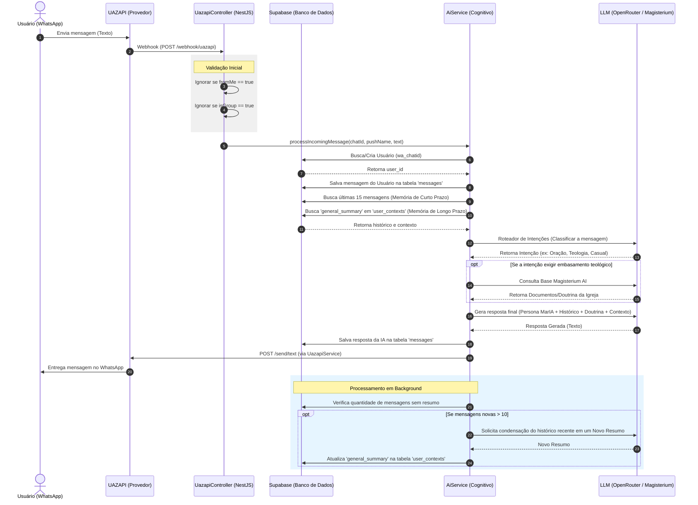

# Fluxo de Mensagens (Message Flow) - MarIA

Este documento detalha o fluxo de vida de uma mensagem na arquitetura da MarIA, desde o momento em que o fiel envia uma mensagem no WhatsApp até o momento em que ele recebe a resposta da Inteligência Artificial.

## Diagrama Arquitetural (Sequence Diagram)

O diagrama abaixo ilustra a interação entre os componentes: Cliente (WhatsApp), Provedor (UAZAPI), Backend (NestJS), Banco de Dados (Supabase) e os Modelos de Linguagem (OpenRouter/Magisterium).

## Descrição das Fases

### 1. Recebimento e Triagem
O usuário envia a mensagem pelo WhatsApp. A UAZAPI (serviço não-oficial conectado ao número) dispara um evento (Webhook) via método `POST` para o nosso backend NestJS (`/webhook/uazapi`). O controlador filtra mensagens que não devem ser processadas (mensagens em grupos ou mensagens que o próprio bot enviou para ele mesmo).

### 2. Identificação e Persistência Inicial
O `AiService` contacta o **Supabase** para verificar se aquele `wa_chatid` já existe na base de dados (Tabela `users`). Se não existir, ele é criado. Em seguida, a mensagem recém-recebida é salva na tabela `messages` com a `role: 'user'`.

### 3. Construção da Memória
Para a MarIA ter ciência de quem é a pessoa e sobre o que estavam falando, o sistema busca duas informações cruciais no banco de dados:
1. **Memória de Curto Prazo:** As últimas 15 mensagens do chat.
2. **Memória de Longo Prazo:** Um resumo geral de quem é o usuário, quais são seus problemas e interesses (Tabela `user_contexts`).

### 4. Processamento Cognitivo e Roteamento (Two-Step Prompting)
Aqui ocorre a mágica. Primeiro, a mensagem passa por um LLM mais leve e rápido que serve como **Roteador**, para entender a intenção do fiel.
Se o assunto for complexo (ex: dúvidas bíblicas), o serviço aciona a **Magisterium AI** para trazer embasamento católico confiável.
Por fim, todo esse pacote (Histórico + Contexto do Usuário + Regras do Painel + Doutrina) é enviado para o LLM principal (GPT-4o-mini), que vestirá a Persona da MarIA e redigirá a resposta carinhosa e maternal.

### 5. Persistência Final e Envio
A resposta gerada pela IA é salva no banco de dados (tabela `messages`, com a `role: 'assistant'`). Então, o `UazapiService` dispara a requisição de volta para a UAZAPI, que encaminha a mensagem para o WhatsApp do celular do usuário.

### 6. Atualização Assíncrona de Contexto
Para não onerar o tamanho do prompt (e não gastar muitos tokens), a cada 10 mensagens novas, um processo em segundo plano (*background*) engatilha uma chamada ao LLM pedindo que ele leia as conversas recentes e faça um **novo resumo geral** da vida do fiel. Esse resumo substitui o anterior na tabela `user_contexts`, garantindo que a MarIA nunca se esqueça dos fatos mais importantes daquela pessoa.
