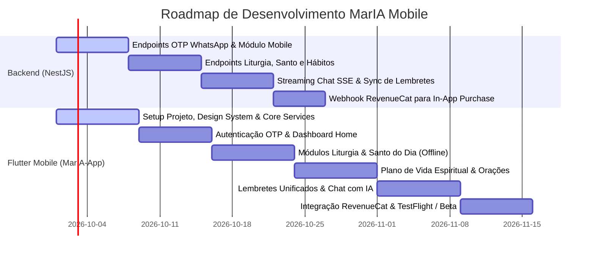

# MarIA Mobile — Documento de Arquitetura & Plano de Desenvolvimento

> **Versão:** 1.0.0  
> **Status:** Aprovado para Planejamento  
> **Stack:** Flutter (Dart), NestJS (Backend), Supabase (PostgreSQL), Redis/BullMQ, Uazapi (WhatsApp API)  
> **Repositório do App:** `AcutisTech/MarIA-App` (Repositório Git Dedicado e Separado)  
> **Repositório do Backend/Admin:** `AcutisTech/MarIA`  

---

## 1. Visão Geral & Objetivos Estratégicos

O **MarIA Mobile** é uma expansão do ecossistema MarIA para além do WhatsApp, transformando-se em um **santuário digital interativo e contemplativo** para smartphones (iOS e Android). O objetivo é oferecer uma experiência visual rica, sacra e interativa de espiritualidade católica, mantendo a sinergia com o canal do WhatsApp já consolidado.

### Pilares Fundamentais:
1. **Espiritualidade Visual e Imersiva:** Conteúdo católico apresentado com nobreza tipográfica, arte sacra tratada, transições suaves e modo escuro para leitura em ambientes sagrados (capelas, igrejas).
2. **Alta Fidelidade Offline:** Liturgia diária, orações tradicionais e rotinas de hábitos disponíveis instantaneamente, mesmo em locais sem conexão de dados.
3. **Privacidade e Sigilo Espiritual (LGPD Compliant):** Total isolamento entre conversas de aconselhamento no app e histórico do WhatsApp. O histórico pessoal de desabafo e oração não é exposto ou cruzado entre canais.
4. **Sincronia Inteligente de Lembretes:** Criação de lembretes devocionais no aplicativo com entrega simultânea no celular (Notificação Push nativa com badaladas sacras) e/ou no WhatsApp (via agendamento com BullMQ).

---

## 2. Separação de Repositórios & Estratégia Git

Para garantir ciclos de vida independentes, automação de build (CI/CD) limpa e gestão de dependências sem conflitos:

* **Repositório Backend & Admin:** `d:\Programming\AcutisTech\MarIA`
  * Contém o NestJS, workers BullMQ, Uazapi, migrations do Supabase e o painel Admin Next.js.
* **Repositório do App Móvel:** `d:\Programming\AcutisTech\MarIA-App`
  * Repositório Git exclusivo para o código Flutter.
  * Contém os manifests Android (`AndroidManifest.xml`), projetos Xcode (`Runner.xcworkspace`), pipelines Fastlane e GitHub Actions para geração de `.ipa` (App Store) e `.aab` (Google Play).

---

## 3. Padrão Arquitetural do Aplicativo (Clean Architecture + Feature-First + Services)

O aplicativo seguirá o padrão **Clean Architecture orientada a Features** com uma camada transversal de **Serviços Globais (Core Services)**. Esse é o padrão mais maduro, escalável e de fácil manutenção no ecossistema Flutter corporativo.

```
lib/
├── core/
│   ├── constants/               # Constantes de API, assets, chaves de storage
│   ├── errors/                  # Failures e Exceptions tipadas
│   ├── network/                 # Cliente HTTP (Dio), Interceptors de Token, Retry, SSL Pinning
│   ├── services/                # SERVIÇOS GLOBAIS REUTILIZÁVEIS
│   │   ├── api_service.dart     # Wrapper unificado de requisições
│   │   ├── auth_service.dart    # Gerenciamento de sessão, token JWT e refresh
│   │   ├── storage_service.dart # Persistência local segura (FlutterSecureStorage + SharedPreferences/Hive)
│   │   ├── notification_service.dart # Push notifications (FCM/APNs) e locais (flutter_local_notifications)
│   │   ├── audio_service.dart   # Player de áudio para reflexões e terço (background audio)
│   │   └── connectivity_service.dart # Monitoramento de status online/offline
│   ├── theme/                   # Design System Sacro (Cores litúrgicas, tipografia serifada/moderna)
│   └── utils/                   # Formatadores de data litúrgica, helpers de texto
│
├── features/                    # MÓDULOS DE NEGÓCIO ISOLADOS
│   ├── auth/                    # Login via WhatsApp OTP
│   │   ├── data/
│   │   │   ├── datasources/     # AuthRemoteDataSource
│   │   │   ├── models/          # UserModel, AuthTokenDto
│   │   │   └── repositories/   # AuthRepositoryImpl
│   │   ├── domain/
│   │   │   ├── entities/        # UserEntity
│   │   │   ├── repositories/   # IAuthRepository (Contrato)
│   │   │   └── usecases/        # RequestOtpUseCase, VerifyOtpUseCase, LogoutUseCase
│   │   └── presentation/
│   │       ├── controllers/     # AuthNotifier (Riverpod)
│   │       ├── pages/           # PhoneInputPage, OtpVerificationPage
│   │       └── widgets/         # PinCodeField, CountryCodePicker
│   │
│   ├── home/                    # Dashboard diário (Hub central do fiel)
│   │   └── presentation/        # HomePage, DailySummaryCard, QuickActionsRow
│   │
│   ├── liturgy/                 # Liturgia Diária
│   │   ├── data/ (Remote API + Local Cache para offline)
│   │   ├── domain/ (LiturgyEntity, Readings, Gospel)
│   │   └── presentation/ (LiturgyPage, ReadingViewerWidget, FontSizeSlider)
│   │
│   ├── saint_of_day/            # Santo do Dia
│   │   ├── data/ (SaintModel, Biografia, Oração, Imagem remota/cache)
│   │   ├── domain/ (SaintEntity)
│   │   └── presentation/ (SaintHeroCard, SaintDetailPage)
│   │
│   ├── spiritual_plan/          # Planos de Vida Espiritual & Hábitos
│   │   ├── data/ (HabitModel, StreakDto, LocalPersistence)
│   │   ├── domain/ (HabitEntity, MarkHabitCompletedUseCase)
│   │   └── presentation/ (HabitTrackerWidget, SpiritualRoutinePage)
│   │
│   ├── prayers/                 # Biblioteca de Orações & Exame
│   │   ├── data/ (PrayerModel, PrayerCategory)
│   │   ├── domain/ (PrayerEntity)
│   │   └── presentation/ (PrayersCatalogPage, InteractiveRosaryPage, ConscienceExamPage)
│   │
│   ├── reminders/               # Lembretes Integrados
│   │   ├── data/ (ReminderModel, SyncRepository)
│   │   ├── domain/ (ReminderEntity, ScheduleReminderUseCase)
│   │   └── presentation/ (RemindersListPage, CreateReminderModal)
│   │
│   └── chat_ai/                 # Chat Nativo com a MarIA (Isolado e Seguro)
│       ├── data/ (ChatStreamDataSource, LocalMessageStore)
│       ├── domain/ (ChatMessageEntity, SendPrayerQueryUseCase)
│       └── presentation/ (ChatPage, MessageBubble, FloatingMarIAButton)
│
└── main.dart
```

### Por que esta estrutura é superior?
1. **Desacoplamento Absoluto:** A camada `domain` não depende de nenhuma biblioteca externa (nem do Flutter, nem do Dio, nem do Riverpod). Contém puramente regras de negócio.
2. **Serviços Globais Compartilhados:** A pasta `core/services/` centraliza comportamentos que atravessam múltiplas features (como áudio, notificações, requisições HTTP e armazenamento seguro), evitando duplicação de lógica.
3. **Testabilidade Real:** Permite mockar `DataSources` e testar `UseCases` e `Notifiers` sem precisar subir o app ou emulador.
4. **Gerenciamento de Estado:** **Flutter Riverpod 2.x**. Oferece injeção de dependência nativa, tipagem estrita, cache automático e descarte inteligente de estado sem memória vazando.

---

## 4. Detalhamento dos Módulos Principais (Escopo V1)

### 4.1. Autenticação Unificada por WhatsApp OTP (Zero Custo com SMS)
* **Objetivo:** O usuário não precisa lembrar senhas nem pagar por SMS.
* **Fluxo:**
  1. No app, o usuário insere seu telefone com DDD (ex: `11999998888`).
  2. O app chama `POST /auth/mobile/request-otp` no backend NestJS.
  3. O backend gera um PIN criptograficamente aleatório de 6 dígitos (TTL de 5 min no Redis) e despacha via Uazapi para o WhatsApp do usuário:
     > *"Seu código de acesso ao app MarIA é: **739-104**. Não repasse a ninguém."*
  4. O app captura o PIN e chama `POST /auth/mobile/verify-otp`.
  5. O backend valida o hash, localiza o cadastro do usuário na tabela `users` do Supabase e retorna o token de autenticação (JWT) e o perfil.

### 4.2. Santo do Dia
* **Recursos:**
  * Nome do santo, memória litúrgica e data comemorativa.
  * Imagem de arte sacra com fallback elegante (caso a imagem não esteja disponível, renderiza uma arte vetorial sacra geométrica com a auréola mariana).
  * Biografia acessível, virtude inspiradora para o dia e oração de intercessão do santo.
  * Compartilhamento de card bonito no Instagram Stories e WhatsApp.

### 4.3. Liturgia Diária com Modo Noturno e Acessibilidade
* **Recursos:**
  * 1ª Leitura, Salmo Responsorial (refrão destacado para oração), 2ª Leitura (quando houver), Evangelho do dia e Homilia/Reflexão.
  * **Armazenamento Offline:** A liturgia da semana é baixada em lote em segundo plano. Na igreja ou no retiro espiritual sem sinal 4G, o app abre instantaneamente.
  * Ajuste de tipografia (diminuir/aumentar tamanho da fonte, alternar para modo sepia ou noturno profundo para preservar a vista).
  * Áudio player integrado com reprodução contínua da leitura e reflexão.

### 4.4. Plano de Vida Espiritual (Rotinas & Hábitos Católicos)
* **Conceito:** Ajudar o fiel a construir constância na oração (o "Plano de Vida" de São Josemaria e da tradição cristã).
* **Hábitos Nativos:**
  1. *Oferecimento do Dia* (ao acordar)
  2. *Liturgia e Oração Mental* (15 min)
  3. *Angelus* (12h ou 18h)
  4. *Santo Terço* (ou mistério do dia)
  5. *Exame de Consciência Noturno* (com o roteiro do exame já implementado)
* **Interface:** Checklist tátil com indicador circular de progresso do dia, streaks semanais e calendário mensal de frequência de oração.

### 4.5. Lembretes Unificados (App Push + WhatsApp)
* **Integração:**
  * O usuário cria um lembrete no app (ex: *"Rezar o Angelus às 12:00"*).
  * Opções de notificação (toggles independentes):
    * `[x] Notificar no Celular (Push Notification com som suave de carrilhão)`
    * `[x] Notificar no WhatsApp (Mensagem da MarIA)`
  * Ao salvar com opção WhatsApp ativada, o app faz a requisição para o backend NestJS, que agenda a fila BullMQ já existente com reagendamento diário.

### 4.6. Chat com MarIA (Isolado e Seguro)
* **Privacidade e LGPD:** O chat no aplicativo é uma sessão **isolada**. Ele não expõe o histórico trocado no WhatsApp e vice-versa.
* **Experiência:**
  * Acesso por meio de um Floating Action Button sutil na Home.
  * Respostas em streaming de texto (Server-Sent Events), simulando uma conversa espiritual em tempo real.
  * Botões de atalho rápido: *"Como lidar com a ansiedade à luz da Bíblia?"*, *"Me ajude a me preparar para a confissão"*, *"Sugestão de oração para a família"*.

---

## 5. Estratégia de Monetização & Aprovação nas Lojas (Apple e Google)

### O Desafio Regulatório:
* A Apple (App Store Review Guidelines 3.1.1) e o Google Play exigem que qualquer conteúdo digital desbloqueado no app utilize **In-App Purchase (IAP)**.
* Se colocarmos botões do Asaas ou links de Pix dentro do app, o aplicativo será reprovado na revisão das lojas.

### A Solução Híbrida Oficial:
1. **Assinantes Existentes (Asaas/WhatsApp):**
   * O usuário que já assina pelo WhatsApp faz login com seu número.
   * O backend NestJS informa que o usuário tem `subscription_tier: 'premium'`. O app libera todos os recursos automaticamente sem cobrança duplicada.
2. **Novos Assinantes via App (In-App Purchase com RevenueCat):**
   * Implementação do SDK `purchases_flutter` (RevenueCat) no app.
   * O usuário pode assinar o plano com 1 toque usando a biometria do próprio iPhone ou Android.
   * O RevenueCat dispara um webhook seguro para o NestJS (`POST /billing/revenuecat-webhook`), que atualiza o registro do usuário no Supabase.
   * **Resultado:** Aprovação garantida na Apple e Google, e conversão máxima de usuários nativos.

---

## 6. Endpoints Necessários no Backend NestJS

Para suportar o aplicativo móvel, adicionaremos um módulo `mobile` no backend NestJS existente:

| Método | Endpoint | Descrição |
| :--- | :--- | :--- |
| `POST` | `/api/v1/mobile/auth/request-otp` | Envia código de 6 dígitos via WhatsApp Uazapi |
| `POST` | `/api/v1/mobile/auth/verify-otp` | Valida o código e retorna JWT de sessão |
| `GET` | `/api/v1/mobile/liturgy/today` | Retorna a liturgia completa do dia atual |
| `GET` | `/api/v1/mobile/liturgy/week` | Retorna o pacote semanal para cache offline |
| `GET` | `/api/v1/mobile/saint/today` | Retorna informações e imagem do Santo do Dia |
| `GET` | `/api/v1/mobile/prayers` | Lista catálogo de orações e novenas |
| `GET/POST`| `/api/v1/mobile/habits` | Lista e registra conclusão dos hábitos diários |
| `POST` | `/api/v1/mobile/reminders/sync`| Cria ou atualiza lembrete com sincronia no BullMQ |
| `POST` | `/api/v1/mobile/chat` | Endpoint de streaming com a IA MarIA (SSE) |

---

## 7. Roadmap de Entrega em Sprints



---

## 8. Próximos Passos Imediatos
1. Versionar este documento e o repositório `MarIA-App`.
2. Criar a estrutura inicial de pastas e dependências no repositório `d:\Programming\AcutisTech\MarIA-App`.
3. Desenvolver os dois primeiros endpoints no backend NestJS (`request-otp` e `verify-otp`).
